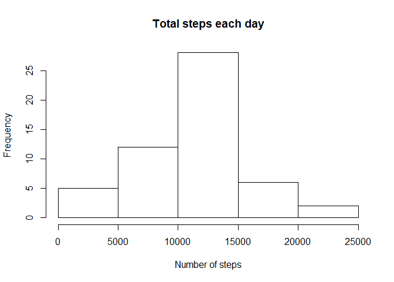
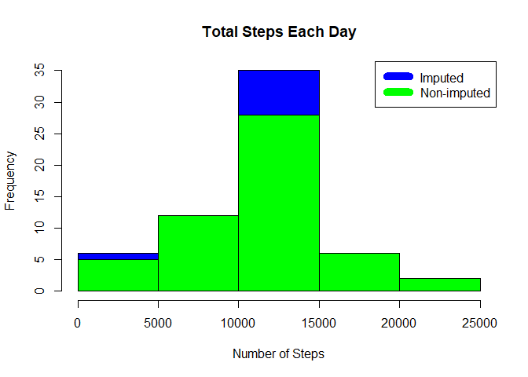

## Loading and preprocessing the data
Code for reading in the dataset and/or processing the data

```r
if(!file.exists("getdata-projectfiles-UCI HAR Dataset.zip")) {
        temp <- tempfile()
        download.file("http://d396qusza40orc.cloudfront.net/repdata%2Fdata%2Factivity.zip",temp)
        unzip(temp)
        unlink(temp)
}
```

```r
activityData<-read.csv("activity.csv")
```


## What is mean total number of steps taken per day?

```r
aggDayAct<- aggregate(steps ~ date, activityData,sum)
```

Histogram of the total number of steps taken each day

```r
hist(aggDayAct$steps,xlab="Number of steps",main="Total steps each day")
```

<!-- -->

Mean and median number of steps taken each day

```r
stepsMedian<-median(aggDayAct$steps)
stepsMean<-mean(aggDayAct$steps)
```

The `mean` is 1.0766189\times 10^{4} and `median` is 10765.


## What is the average daily activity pattern?
Time series plot of the average number of steps taken


```r
steps_by_interval <- aggregate(steps ~ interval, activityData, mean)
plot(steps_by_interval$interval,steps_by_interval$steps, type="l", xlab="Interval", ylab="Number of Steps",main="Average Number of Steps per Day by Interval")
```

<!-- -->

```r
max_interval <- steps_by_interval[which.max(steps_by_interval$steps),1]
```
The 5-minute interval that, on average, contains the maximum number of steps is 835


## Imputing missing values

```r
incomplete <- sum(!complete.cases(activityData))
```

Total number of missing values in te dataset is 2304

Missing values are imputed by inserting the average for each interval. Thus, if interval 10 was missing on 10-02-2012, the average for that interval for all days, replaced the NA. 

```r
imputed_data <- transform(activityData, steps = ifelse(is.na(activityData$steps), steps_by_interval$steps[match(activityData$interval, steps_by_interval$interval)], activityData$steps))
```

Zeroes were imputed for 10-01-2012 because it was the first day and would have been much higher than the following day, which had only 126 steps. NAs then were assumed to be zeros to fit the rising trend of the data. 

```r
imputed_data[as.character(imputed_data$date) == "2012-10-01", 1] <- 0
```

Recount total steps by day and create Histogram. 

```r
aggDayAct_i <- aggregate(steps ~ date, imputed_data, sum)
hist(aggDayAct_i$steps, main = paste("Total Steps Each Day"), col="blue", xlab="Number of Steps")
#Create Histogram showing difference between original data and imputed data. 
hist(aggDayAct$steps, main = paste("Total Steps Each Day"), col="green", xlab="Number of Steps", add=T)
legend("topright", c("Imputed", "Non-imputed"), col=c("blue", "green"), lwd=10)
```

<!-- -->

Calculate mean and median for imputed data. 

```r
stepsMean.i <- mean(aggDayAct_i$steps)
stepsMedian.i <- median(aggDayAct_i$steps)
```

Calculate difference between imputed and non-imputed data.

```r
mean_diff <- stepsMean.i - stepsMean
median_diff <- stepsMedian.i - stepsMedian
```

Calculate total difference.

```r
total_diff <- sum(aggDayAct_i$steps) - sum(aggDayAct$steps)
```
* The imputed data mean is 1.0589694\times 10^{4}
* The imputed data median is 1.0766189\times 10^{4}
* The difference between the non-imputed mean and imputed mean is -176.4948964
* The difference between the non-imputed mean and imputed mean is 1.1886792
* The difference between total number of steps between imputed and non-imputed data is 7.5363321\times 10^{4}. Thus, there were 7.5363321\times 10^{4} more steps in the imputed data.


## Are there differences in activity patterns between weekdays and weekends?
Create a plot to compare and contrast number of steps between the weekday and weekend. There is a higher peak earlier on weekdays, and more overall activity on weekends.  

```r
weekdays <- c("Monday", "Tuesday", "Wednesday", "Thursday", 
              "Friday")
imputed_data$dow = as.factor(ifelse(is.element(weekdays(as.Date(imputed_data$date)),weekdays), "Weekday", "Weekend"))
steps_by_interval_i <- aggregate(steps ~ interval + dow, imputed_data, mean)
library(lattice)
xyplot(steps_by_interval_i$steps ~ steps_by_interval_i$interval|steps_by_interval_i$dow, main="Average Steps per Day by Interval",xlab="Interval", ylab="Steps",layout=c(1,2), type="l")
```

<!-- -->

